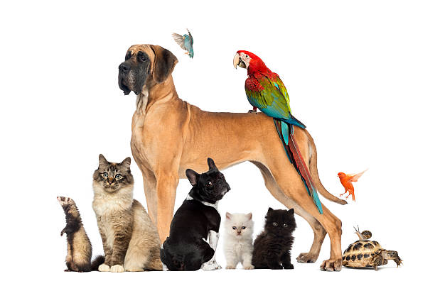
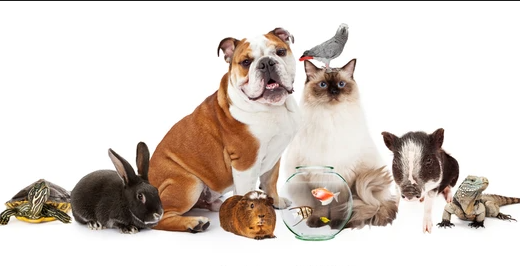

Creating my first Project
Using HTML and CSS
Markup-contains text and tags 
Markdown- simplified information

CSS= Cascading Style Sheets=elements of style decorations from multiple sources

Save for fixed images
        
        

        Next will be working on a fixed nav bar and making main page prettier

        work on filling home page
        work on filling other pages
        style other pages 
        use bootstrap on gallery page to make it cleaner

        Deleted several old depositories due to confusion
        googled how to fix 404 server issue with images not loading from github depository url

        learned to add images as seperate file in github
        learned that there is no need for seperate files for html, css and js

        basic page for pet sitting services 

        need to figure out how to link different pages back to home screen

        add carousel images and create a better logo

        images folder created in github by accident, reasearching how to delete
